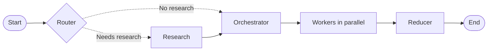
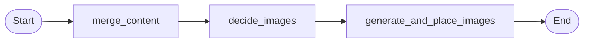

# Blog Writing Multi-Agent System

A LangGraph-based multi-agent blog writing system with research, parallel section writing, image generation, checkpointing, and a Streamlit UI.

## Workflow



| Node | Purpose |
| --- | --- |
| Router | Decides whether the topic can be written from model knowledge or needs web research. Produces `needs_research`, `mode`, and search queries. |
| Research | Uses Tavily to collect evidence items such as title, URL, snippet, and published date. |
| Orchestrator | Produces a structured Pydantic `Plan` with blog title, audience, tone, constraints, and section tasks. |
| Worker | Runs one worker per planned task using LangGraph `Send`; each worker writes one Markdown section. |
| Reducer | Combines worker sections, plans image placement, generates images, and writes the final Markdown. |

## Notebook Progression

| File | What It Demonstrates |
| --- | --- |
| `1_basic_blog_writing_agent.ipynb` | Basic planner-worker-reducer architecture. The orchestrator creates a Pydantic plan, workers write sections, and reducer stitches Markdown. |
| `2_basic_agent_w_enhanced_prompt.ipynb` | Same graph shape with stronger prompts and richer `Plan` / `Task` schemas such as tone, bullets, target words, and section intent. |
| `3_final_agent_w_research_agent.ipynb` | Adds router and research nodes. Workers receive evidence and cite sources directly in Markdown. |
| `4_final_agent_w_images_in_reducer.ipynb` | Converts reducer into a subgraph for merge, image planning, image generation, and placeholder replacement. |
| `5_final_agent_w_streamlit_ui_frontend.py` + `5_final_agent_w_streamlit_ui_backend.py` | Streamlit app with checkpoint-backed sessions, past-session loading, delete, progress display, and rerun-from-node support. |

## State And Fan-Out

The graph state carries the topic, routing decision, research evidence, plan, generated sections, image specs, and final Markdown. In the Streamlit app it also carries a `thread_id` so checkpoints and artifacts can be tied to a specific UI session.

The orchestrator creates a list of tasks. The `fanout` function creates one LangGraph `Send()` per task and passes each worker only the payload it needs: task, topic, plan, mode, and evidence. Worker outputs are accumulated into `sections` using an `operator.add` reducer. Sections are then sorted by task id before final merge, so the final blog follows the planned section order even though workers run in parallel.

## Research And Citations

Citations are prompt-driven, not added by a Python post-processing step.

```text
Tavily search
-> EvidenceItem(title, url, snippet, published_at)
-> Worker receives evidence URLs
-> Worker prompt asks for Markdown citations
-> LLM writes ([Source](URL))
-> Reducer saves final Markdown as-is
```

The reducer does not create, rewrite, or render citation links. It only combines worker-generated Markdown.

## Image Reducer

The image-capable reducer is a subgraph:



| Reducer Step | Purpose |
| --- | --- |
| `merge_content` | Combines ordered worker sections into one Markdown blog. |
| `decide_images` | Uses structured output to produce `md_with_placeholders` and `ImageSpec` items. Placeholders look like `[[IMAGE_1]]`. |
| `generate_and_place_images` | Generates images from prompts, saves them to disk, and replaces placeholders with Markdown image links. |

`ImageSpec` contains fields such as placeholder, filename, alt text, caption, prompt, size, and quality. The current app uses Pollinations with the `flux` model for image generation. The image-planning step retries up to 10 times when the model returns an empty image list.

## Streamlit App

The Streamlit UI supports:

- New blog generation.
- Unique session/thread id per blog run.
- SQL checkpointing via `langgraph-checkpoint-sqlite`.
- Past-session loading from checkpoint state, not from Markdown files.
- Full session display: plan, evidence, Markdown preview, images, and checkpoint logs.
- Rerun from a selected node/checkpoint.
- Past-session deletion, including checkpoint rows and session artifacts.
- Session-scoped artifacts to avoid filename collisions.

Artifacts are written under `output/`:

```text
output/5_<thread_id>_<blog_title>.md
output/images/<thread_id>/<image_file>
output/langgraph_checkpoints_webapp.sqlite
```

## Rerun And Resume

Every Streamlit execution uses a LangGraph `thread_id`. The app lists saved sessions from the SQLite checkpointer. For a loaded session, the UI can list rerunnable checkpoints and resume from a selected node.

This is useful when a model call, schema validation, network call, or image generation step fails. Instead of rerunning the whole graph from scratch, load the session and rerun from the relevant node.

## Known Practical Notes

- Structured output is enforced with Pydantic models. If the LLM returns invalid structure, the graph can fail.
- The image planner can occasionally return empty or invalid image specs; the reducer includes a retry loop.
- Tavily/network/SSL failures should surface as real errors rather than silently becoming empty evidence.
- Pollinations may return JPEG bytes even when the filename extension is `.png`; Streamlit/PIL can still render valid image bytes, but file extensions may not always reflect the actual image encoding.
- The UI filters image files by extension and scopes display to the selected session image folder.

## Setup

Create a `.env` file with the required keys:

```env
GOOGLE_API_KEY=""
TAVILY_API_KEY=""
POLLINATIONS_API_KEY=""
```

Install dependencies:

```bash
pip install -r requirements.txt
```

Run the Streamlit app:

```bash
streamlit run 5_final_agent_w_streamlit_ui_frontend.py
```

