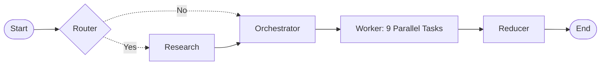

# Blog Writing Multi-Agent System (LangGraph + Streamlit UI)

A multi-agent blog writing system built with LangGraph, featuring a Streamlit UI for interaction.

## Architecture

Multi-agent workflow with **Router → Research → Orchestrator → Workers → Reducer** pipeline:

### Agent Roles

| Agent | Role |
|-------|------|
| **Router** | Decides if topic needs internet research or can be written directly |
| **Research** | Generates 6-7 search queries, fetches results via Tavily |
| **Orchestrator** | Plans blog sections, creates work items for each section |
| **Worker** | 9 parallel workers write individual blog sections simultaneously |
| **Reducer** | Consolidates all sections, identifies image gaps, generates & inserts images |
