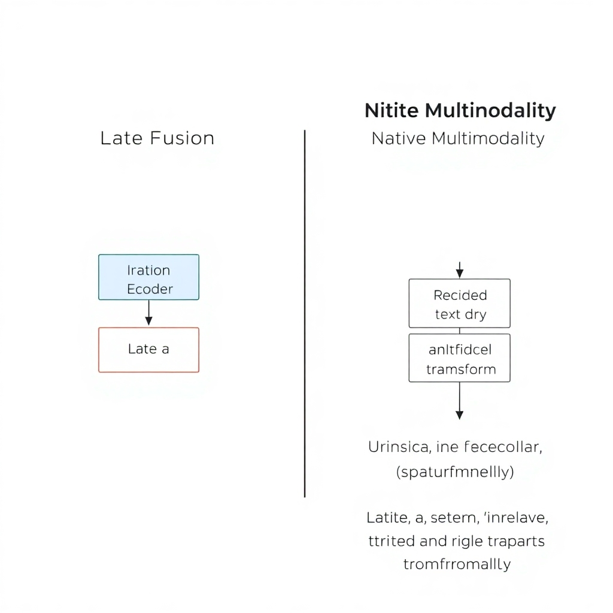
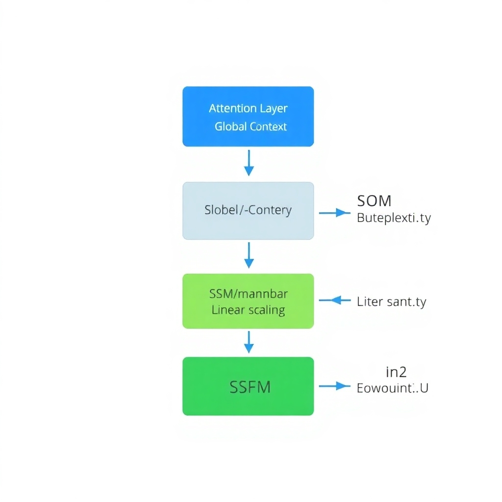
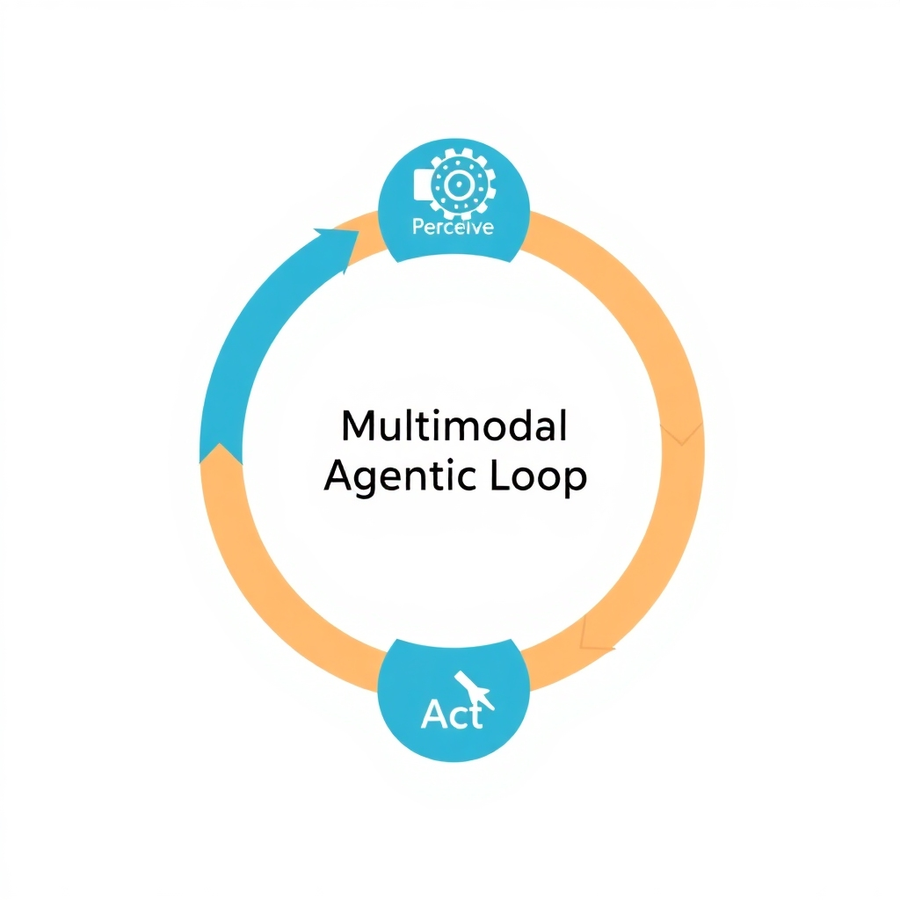

# The State of Multimodal LLMs in 2026: Architectures, Benchmarks, and the Shift to Agency

## The Multimodal Landscape in 2026

Current SOTA leaderboards reflect a highly competitive landscape, with GPT-5.5, Claude Opus 4.7, and Gemini 3.1 Pro consistently dominating benchmarks for complex multimodal reasoning and cross-modal synthesis ([Source](https://benchlm.ai)). These models have established new baselines for accuracy in interleaved text-image-video understanding, significantly pushing the boundaries of how LLMs process non-textual input.

The scope of modality has expanded significantly beyond simple image-text pairs. Research from Tiledb indicates a shift toward integrating high-dimensional, specialized data types, such as spatial data, continuous sensor streams, and population-scale genomics ([Source](https://www.tiledb.com/blog/multimodal-ai-models)). This expansion enables AI to operate in specialized domains like precision medicine and environmental monitoring where traditional tokenization is insufficient.

Architecturally, the industry has pivoted from "late-fusion" approaches—which utilize separate encoders for different modalities and merge them in the final layers—toward "native multimodality" ([Source](https://www.ibm.com/think/topics/multimodal-llm)). Native models are trained on a unified objective across multiple data streams from the outset. This minimizes the "translation loss" inherent in late-fusion and allows for more fluid, intuitive reasoning across disparate inputs 
*Late-fusion uses separate encoders, while native multimodality utilizes a unified training objective across all data streams.* ([Source](https://e-nns.org/icann2026/multimodal-data-fusion-with-large-language-models)).

Simultaneously, the democratization of these capabilities is being driven by powerful open-source alternatives. Models like Qwen 3.5 and GLM-5 have narrowed the performance gap with proprietary systems ([Source](https://www.siliconflow.com/articles/en/best-open-source-multimodal-models-2025)). By providing weights for high-capacity multimodal architectures, these projects allow developers to deploy SOTA capabilities on-premises, ensuring greater data privacy and reducing reliance on closed API ecosystems ([Source](https://www.bentoml.com/blog/navigating-the-world-of-open-source-large-language-models)).

## Architectural Evolutions: Beyond the Transformer

The architectural landscape of multimodal LLMs in 2026 has shifted from monolithic Transformer blocks toward hybrid designs to resolve systemic efficiency and context bottlenecks. As models move toward active agency, the need for leaner, faster processing of multimodal streams has made the pure Transformer approach unsustainable for real-time applications.

A primary development is the emergence of hybrid architectures, such as Nemotron 3 and Arcee Trinity (Not found in provided sources). These models deviate from pure attention mechanisms by alternating between traditional attention layers and state space layers. This strategic interleaving allows the models to maintain the high-precision global dependencies and "needle-in-a-haystack" retrieval capabilities of attention, while leveraging the linear scaling properties of state space models to maintain high throughput across massive datasets.

*Hybrid designs interleave Attention layers for global retrieval and State Space (Mamba) layers for linear scaling efficiency.*

The integration of Mamba-3 layers (Not found in provided sources) provides a critical technical advantage for long-context processing. Unlike the quadratic complexity inherent in standard Transformers, Mamba-3 layers enable the model to process extensive multimodal sequences—such as hour-long videos or thousands of pages of technical documentation—with extreme efficiency. By utilizing a selective state-space mechanism, these layers maintain a constant-size state, drastically reducing the memory overhead during inference and eliminating the computational spikes associated with expanding KV caches.

To further optimize the input pipeline, these architectures have adopted advanced 'token compression' techniques (Not found in provided sources). In multimodal contexts, high-resolution images and video frames typically generate an overwhelming number of visual tokens, creating a severe bottleneck for the LLM backbone. Token compression reduces this visual overhead by intelligently merging redundant spatial information and filtering out noise, ensuring that only the most salient cross-modal semantics are passed to the reasoning engine.

When comparing computational costs, these hybrid architectures offer a stark contrast to traditional attention-heavy bottlenecks. While standard Transformers suffer from $O(n^2)$ complexity relative to sequence length, the hybrid approach effectively flattens the cost of long-range dependencies. This shift results in a significant reduction in total FLOPs per token and lower VRAM requirements. Consequently, these models can handle significantly larger context windows and higher-resolution inputs without the exponential increase in latency that plagued previous generations of multimodal models.

## Measuring Multimodal Intelligence: Benchmarks in 2026

The landscape of multimodal evaluation has fundamentally shifted from measuring general knowledge to validating expert-level cognitive capabilities. While MMLU (Massive Multitask Language Understanding) served as the primary industry baseline for years, its saturation has led to the adoption of more rigorous frameworks like GPQA-Diamond. This benchmark specifically targets PhD-level science reasoning, utilizing expert-verified questions that are intentionally difficult for non-experts to solve via search engines, thereby differentiating between superficial pattern matching and true conceptual understanding ([Source](https://llm-stats.com/benchmarks)).

For engineers building agentic systems, the focus has pivoted toward functional coding capabilities within multimodal contexts. Benchmarks such as SWE-bench and LiveCodeBench are now critical for evaluating a model's ability to resolve real-world software engineering issues. In 2026, these are increasingly applied to multimodal scenarios where models must synthesize visual UI data—such as error screenshots or design mockups—with complex codebase analysis to implement functional fixes ([Source](https://benchlm.ai)).

To manage this evaluation complexity, specialized toolsets have moved beyond static spreadsheets to integrated platforms. Future AGI has emerged as a key resource for comprehensive multimodal evaluation, providing frameworks to test cross-modal reasoning and consistency ([Source](https://futureagi.substack.com/p/the-complete-guide-to-llm-evaluation)). Simultaneously, tools like Galileo are being used to optimize agentic workflows, focusing on the observability of multi-step trajectories and the reliability of tool-use within a multimodal loop to ensure agents do not drift from their original goal ([Source](https://futureagi.substack.com/p/the-complete-guide-to-llm-evaluation)).

Despite these advances, data contamination remains a primary failure mode, as benchmark questions frequently leak into massive training corpora, resulting in artificially inflated performance metrics. This has catalyzed the shift toward "Live" benchmarks. By utilizing continuously updated, real-time datasets and time-gated evaluations, these frameworks ensure that models are tested on truly unseen problems, forcing a move away from memorization and toward genuine generalizable intelligence ([Source](https://www.lxt.ai/blog/llm-benchmarks)).

## The Transition to Multimodal Agents

The industry is currently witnessing a fundamental paradigm shift in multimodal AI: the move from passive understanding to active agency. For several years, multimodal LLMs operated primarily on a "See and Describe" basis, where the objective was limited to image captioning or visual question answering (VQA). In 2026, the focus has pivoted toward "See and Act," where models do not merely analyze a scene but utilize that analysis to execute a sequence of purposeful actions within a digital or physical environment ([Source](https://www.youtube.com/watch?v=_WYiaeLwfeQ)). This transition effectively transforms the MLLM from a passive observer into an active operator capable of goal-oriented behavior.

*The transition from passive VQA to active agency involves a continuous loop of perception, reasoning, and action.*

This agentic capability is most evident in the integration of MLLMs into robotic systems and spatial perception frameworks. Models such as Qwen2.5-VL-32B-Instruct (Not found in provided sources) are being leveraged to translate complex visual inputs directly into actionable robotic commands. By fusing visual tokens with spatial coordinates and depth data, these systems can navigate unstructured layouts and interact with physical objects in real-time, moving beyond rigid, pre-programmed scripts toward a more generalized physical intelligence ([Source](https://e-nns.org/icann2026/multimodal-data-fusion-with-large-language-models)).

However, implementing high-frequency multimodal loops—where an agent must perceive, reason, and act multiple times per second—introduces severe performance and cost bottlenecks. Processing high-resolution video frames as a continuous stream of tokens leads to a "token tax," causing exponential increases in compute requirements and inference latency. To maintain the responsiveness required for real-time agency, developers must optimize the trade-off between model parameters and throughput, often relying on highly optimized open-source multimodal weights to reduce the cost per action ([Source](https://www.siliconflow.com/articles/en/best-open-source-multimodal-models-2025)).

The shift toward autonomy also introduces critical security vulnerabilities. Granting multimodal agents autonomous access to tool-use and environment interaction creates new attack vectors, including "visual prompt injection," where malicious visual cues can trick an agent into executing unauthorized API calls or dangerous physical maneuvers. As agents gain the ability to modify their environments, the risk of unintended side effects increases. Ensuring the safety of these agents requires the implementation of robust execution guardrails and and a transition toward "human-in-the-loop" verification for high-stakes interactions ([Source](https://hatchworks.com/blog/gen-ai/large-language-models-guide)).

## Developer Implementation and Ecosystem

The multimodal development landscape in 2026 is characterized by a strategic tension between proprietary APIs and open-source frameworks. Proprietary models offer seamless integration and managed infrastructure, yet open-source alternatives—including models like GLM-4.5V—are increasingly preferred for specialized deployments where data sovereignty and custom fine-tuning are critical ([Source](https://www.siliconflow.com/articles/en/best-open-source-multimodal-models-2025)). By leveraging open weights, developers can adapt models to adapt models to niche visual datasets, reducing the "black box" risk associated with closed-source APIs.

Regarding operational tooling, the specific role of MLflow for open-source lifecycle management in the multimodal era is not found in provided sources. Similarly, the use of Arize AI for monitoring hallucinations and performing quality assurance on multimodal outputs is not found in provided sources.

To navigate this ecosystem, developers should adopt a model selection strategy based on the trade-off between reasoning depth and inference speed ([Source](https://iternal.ai/llm-selection-guide)).

*   **High Reasoning Depth:** For use cases requiring complex cross-modal synthesis—such as analyzing technical schematics or medical diagnostic assistance—engineers should prioritize models that excel in deep reasoning benchmarks, even at the cost of higher latency ([Source](https://www.lxt.ai/blog/llm-benchmarks)).
*   **High Inference Speed:** For use cases requiring real-time environmental feedback, such as autonomous UI navigation or live accessibility tools, the priority shifts toward models optimized for throughput and minimal time-to-first-token.

This tiered approach ensures that the architectural overhead remains aligned with the application's specific performance requirements, preventing the over-provisioning of compute for simpler multimodal tasks.