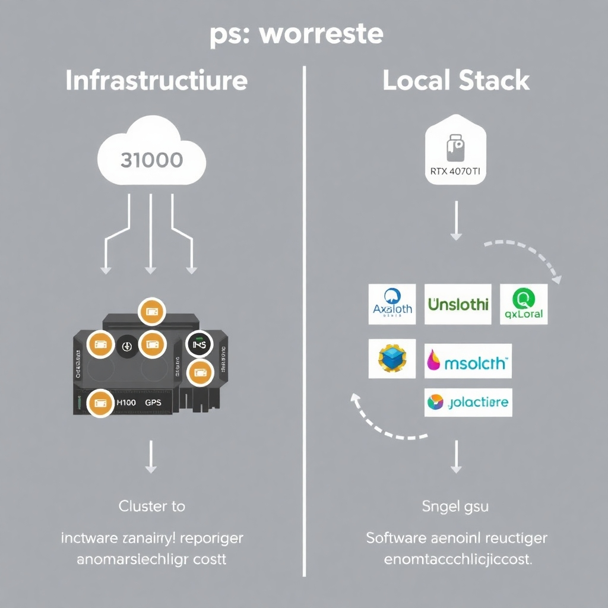
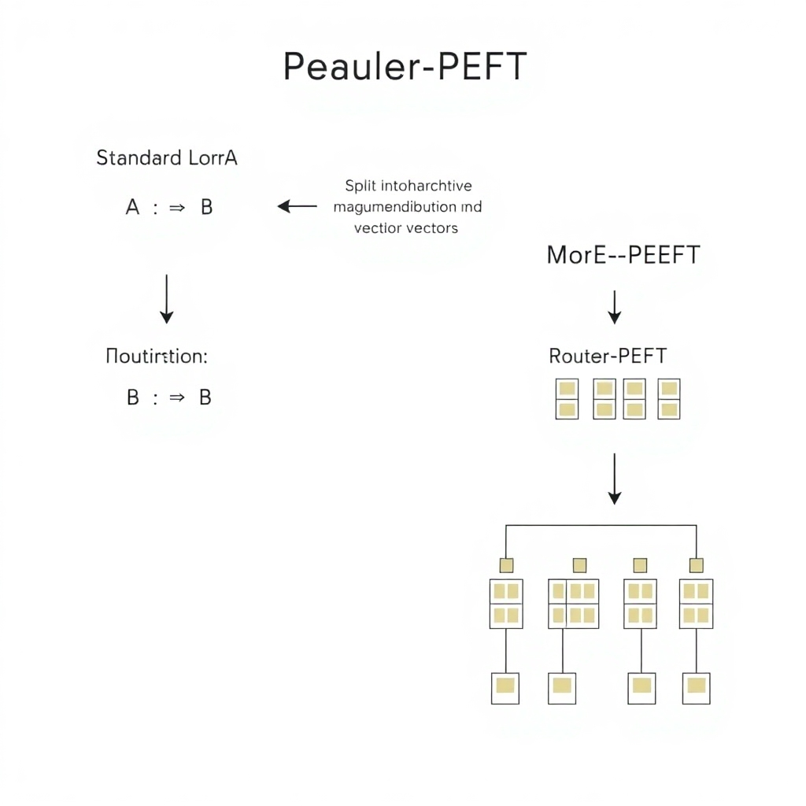
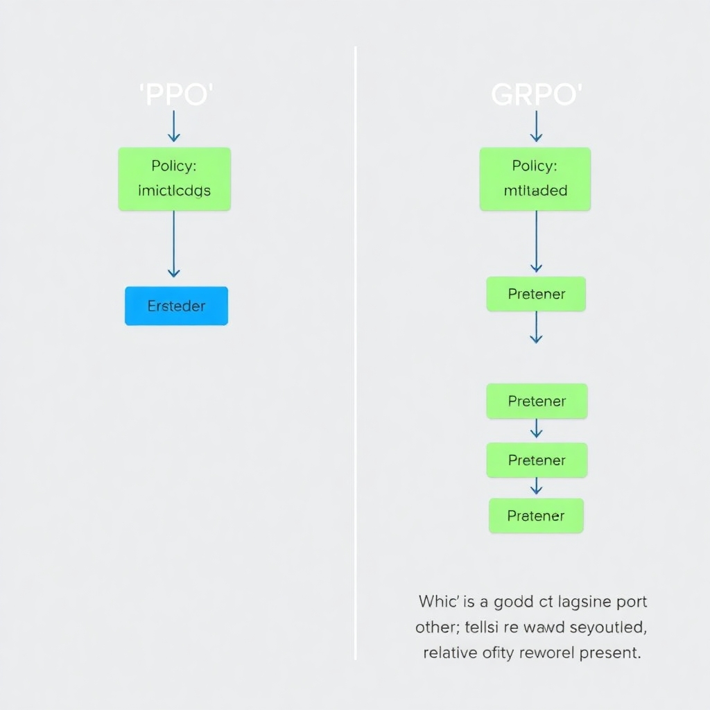

# The State of LLM Fine-Tuning in 2026: From PEFT to GRPO

## The Democratization of Fine-Tuning: Consumer Hardware Breakthroughs

The accessibility of high-performance fine-tuning has shifted dramatically, moving away from exclusive reliance on H100 clusters toward consumer-grade hardware. A primary driver of this shift is the adoption of optimized frameworks like Unsloth and Axolotl, which have significantly reduced memory overhead and increased training speeds by 2-5x ([Source](https://www.sitepoint.com/fine-tune-local-llms-2026)). These tools allow developers to bypass the traditional bottlenecks of VRAM saturation.

*The shift from H100 clusters to optimized local stacks (Unsloth, Axolotl, QLoRA).*

This efficiency makes it feasible to fine-tune 8B-parameter models on GPUs with as little as 12GB of VRAM, such as the RTX 4070 Ti, by leveraging QLoRA to minimize weight precision while maintaining model utility ([Source](https://www.youtube.com/watch?v=v7qMjy_RxOs)).

For developers targeting larger architectures, the workflow has evolved to support models like the 27B Qwen 3.5 on high-end local setups. This process typically integrates specialized quantization techniques and GGUF export, enabling the deployment of these larger models on local inference engines without requiring enterprise-grade infrastructure ([Source](https://www.sitepoint.com/fine-tune-local-llms-2026)).

From a financial perspective, the cost-efficiency of local fine-tuning in 2026 creates a stark contrast with cloud-based GPU clusters. While cloud providers offer massive scalability for pre-training, the elimination of recurring hourly rental fees for mid-sized model iterations makes local hardware the more sustainable and private choice for rapid prototyping and proprietary data handling ([Source](https://www.spheron.network/blog/how-to-fine-tune-llm-2026)).

## Evolution of PEFT: Beyond Standard LoRA

The landscape of Parameter-Efficient Fine-Tuning (PEFT) has evolved beyond basic LoRA to address critical issues like stability and knowledge retention. Recent advancements such as DoRA (Weight-Decomposed Low-Rank Adaptation) and Spectrum are now employed to minimize catastrophic forgetting. By decomposing weights into magnitude and direction components, these methods allow for more precise updates that preserve the base model's general knowledge more effectively than the linear updates found in standard LoRA ([The Ultimate Guide to Fine-Tuning LLMs from Basics to Breakthroughs](https://arxiv.org/html/2408.13296v1)).

*Evolution of Parameter-Efficient Fine-Tuning: from simple rank-decomposition to weight decomposition and routing.*

To ensure high performance in production, Quantization Aware Training (QAT) is increasingly used to maintain precision in compressed models. While standard post-training quantization often leads to significant accuracy drops, QAT simulates the effects of quantization during the fine-tuning process. This enables the model to adapt its weights to the lower-precision constraints, effectively bridging the gap between floating-point precision and integer-based deployment ([What is parameter-efficient fine-tuning (PEFT)?](https://www.ibm.com/think/topics/parameter-efficient-fine-tuning)).

For complex, multi-task deployments, the focus has shifted toward utilizing multiple adapters and Mixture of Experts (MoE) architectures. Instead of a single set of weights for all tasks, MoE-based PEFT utilizes a routing mechanism to activate only the most relevant specialized adapters for a specific query. This prevents "parameter interference," where learning a new task degrades performance on previously acquired skills ([Parameter-Efficient Fine-Tuning (PEFT) of LLMs](https://www.hopsworks.ai/dictionary/parameter-efficient-fine-tuning-of-llms)).

Furthermore, a clear contrast has emerged between additive fine-tuning and selective PEFT. UniPELT serves as a unified additive framework that can dynamically switch between different PEFT techniques to optimize for a specific dataset. In contrast, selective PEFT strategies focus on identifying and updating only a sparse, critical subset of existing parameters, avoiding the addition of new parameters entirely ([Parameter-Efficient Fine-Tuning for Models: Categories and Algorithms](https://medium.com/@techsachin/parameter-efficient-fine-tuning-for-models-categories-and-algorithms-4481fb2bdef0)).

## Reasoning and Alignment: The Rise of GRPO and Beyond

The industry is shifting from simple Supervised Fine-Tuning (SFT) toward advanced alignment techniques that prioritize complex reasoning over simple pattern matching. A key trend in this evolution is Group Relative Policy Optimization (GRPO), which is increasingly utilized to enhance the logical depth and self-correction capabilities of LLMs ([Source](https://arxiv.org/abs/2407.16216)).

*GRPO eliminates the critic model, reducing VRAM overhead during alignment.*

Unlike traditional RLHF methods such as Proximal Policy Optimization (PPO), which requires a computationally expensive critic model to estimate value functions, GRPO optimizes the policy by comparing a group of sampled outputs against one another. This removes the requirement for a separate value-function model, significantly reducing VRAM overhead and compute costs compared to PPO ([Source](https://www.lesswrong.com/posts/iuorxZu6tLFhP7oQY/an-alternative-of-ppo-towards-alignment)). While Direct Preference Optimization (DPO) further simplifies the pipeline by treating alignment as a classification problem, GRPO maintains the iterative reinforcement learning loop essential for developing emergent reasoning behaviors ([Source](https://theneuralmaze.substack.com/p/the-rlhf-landscape-aligning-llms)).

To address the instability and "reward hacking" common in early RLHF implementations, newer alignment methods like Identity Policy Optimization (IPO) and Kahneman-Tversky Optimization (KTO) have emerged. These frameworks improve model stability by refining how the model interprets preference pairs and binary feedback, preventing the policy from collapsing or overfitting to narrow reward signals ([Source](https://medium.com/foundation-models-deep-dive/cutting-edge-advancements-in-rlhf-2023-2025-fe814c770e88)).

Theoretically, alignment is being reframed as "distribution learning" rather than simple scalar reward maximization. In this framework, the objective is to align the model's output distribution with a target distribution of human-like or expert-level reasoning paths ([Source](https://openreview.net/forum?id=TRgEiJ5yN0)). This shift indicates that future fine-tuning will focus less on merely "correcting" final answers and more on mirroring the underlying cognitive distributions of complex problem-solving.

## Hybrid Architectures and Long-Context Efficiency

The fine-tuning landscape is increasingly dominated by hybrid architectures that seek to overcome the "attention bottleneck." Models like Nemotron 3 exemplify this trend, utilizing a design that alternates between traditional attention mechanisms and Mamba-2 layers ([Source](https://magazine.sebastianraschka.com/p/llm-research-papers-2026-part1)). By combining the precise global recall of attention with the linear scaling of State Space Models (SSMs), these architectures provide a more flexible foundation for specialized downstream tasks.

These hybrids fundamentally reshape the requirements for long-context fine-tuning. Unlike purely Transformer-based models, where memory consumption grows quadratically with sequence length, the Mamba-2 components allow for significantly larger context windows during the alignment phase with a drastically reduced VRAM footprint ([Source](https://www.superannotate.com/blog/llm-fine-tuning)). This enables developers to tune models on entire technical documentations or expansive codebases without relying on massive distributed GPU clusters.

However, this efficiency involves distinct performance trade-offs. Purely Transformer-based models still hold a marginal edge in tasks requiring absolute precision across fragmented data points. In contrast, hybrid SSM-Attention models excel in throughput and inference speed, making them ideal for long-form generation, though they may exhibit slight degradation in "needle-in-a-haystack" retrieval accuracy ([Source](https://magazine.sebastianraschka.com/p/llm-research-papers-2026-part1)).

Fine-tuning these non-standard layers also introduces unique failure modes. A primary challenge is gradient instability at the interface between attention and SSM layers, which can lead to divergent loss curves ([Source](https://arxiv.org/html/2408.13296v1)). Furthermore, improper initialization often results in "representation collapse," where the model ignores the SSM state and and relies solely on attention blocks, effectively nullifying the architectural benefits of the hybrid design.

## Multimodal and Domain-Specific Specialization

The evolution of LLM specialization in 2026 focuses on moving beyond general-purpose capabilities toward narrow, high-utility applications tailored to specific industry needs. Regarding the emergence of multimodal fine-tuning for combined text-image-audio tasks, this was not found in provided sources.

Similarly, specific methodologies for sequential fine-tuning and transfer learning for rare domain-specific scenarios were not found in provided sources.

A dominant trend is the strategic shift toward local fine-tuning to safeguard intellectual property. Localized training enables organizations to integrate proprietary datasets and establish a precise brand voice while ensuring that sensitive information remains within a secure, internal environment ([Source](https://www.reddit.com/r/LocalLLaMA/comments/1rwj60g/local_finetuning_will_be_the_biggest_competitive)). This capability is viewed as a primary competitive edge in 2026 ([Source](https://www.sitepoint.com/fine-tune-local-llms-2026)), as it allows developers to bypass the privacy risks and potential data leakage associated with third-party cloud APIs ([Source](https://www.spheron.network/blog/how-to-fine-tune-llm-2026)). By managing their own GPU resources and costs, enterprises can maintain total sovereignty over their model weights, ensuring that domain-specific adaptations remain completely private and proprietary.

Finally, the use of automated hyperparameter optimization tools, such as Optuna, to refine and maximize domain-specific performance was not found in provided sources.