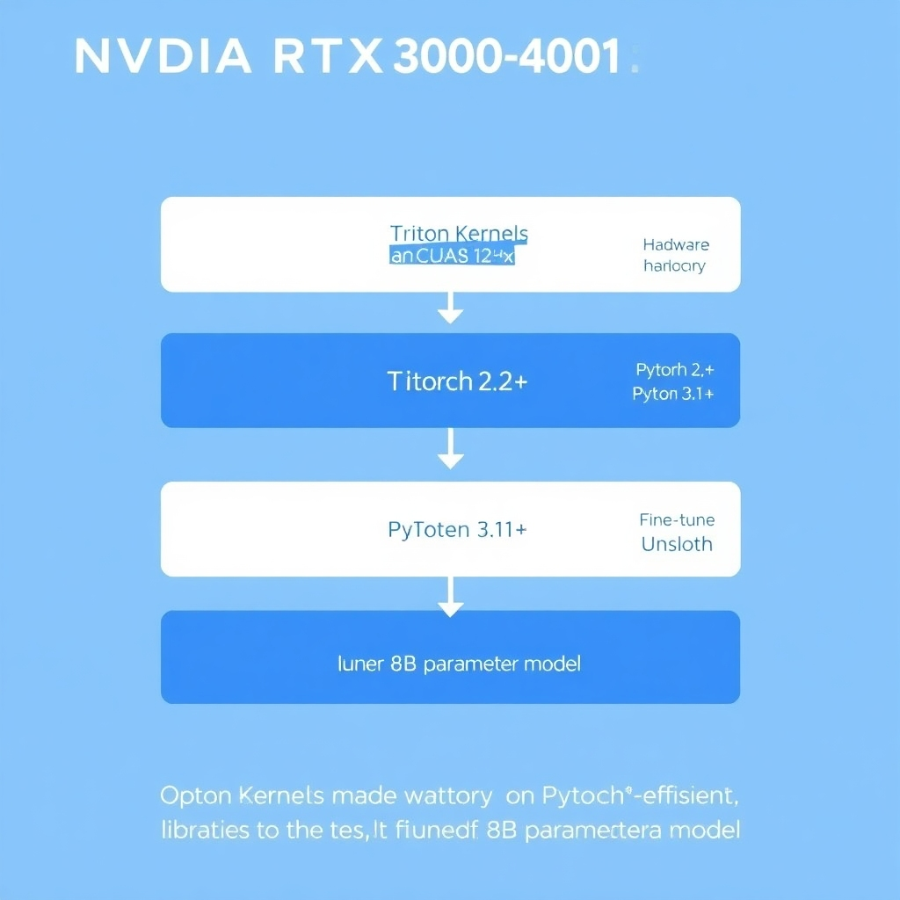
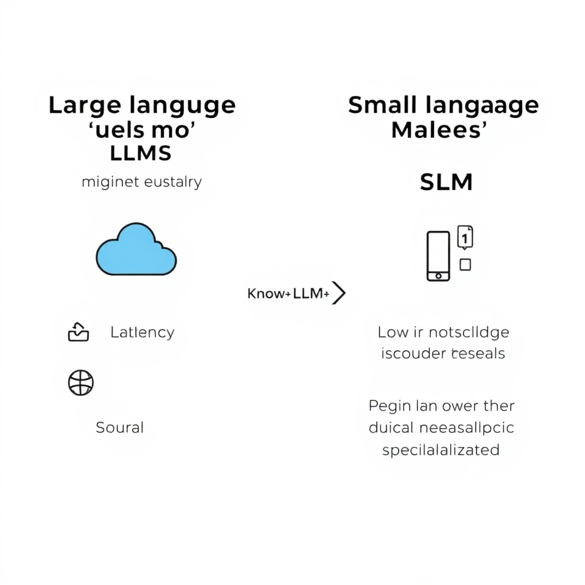
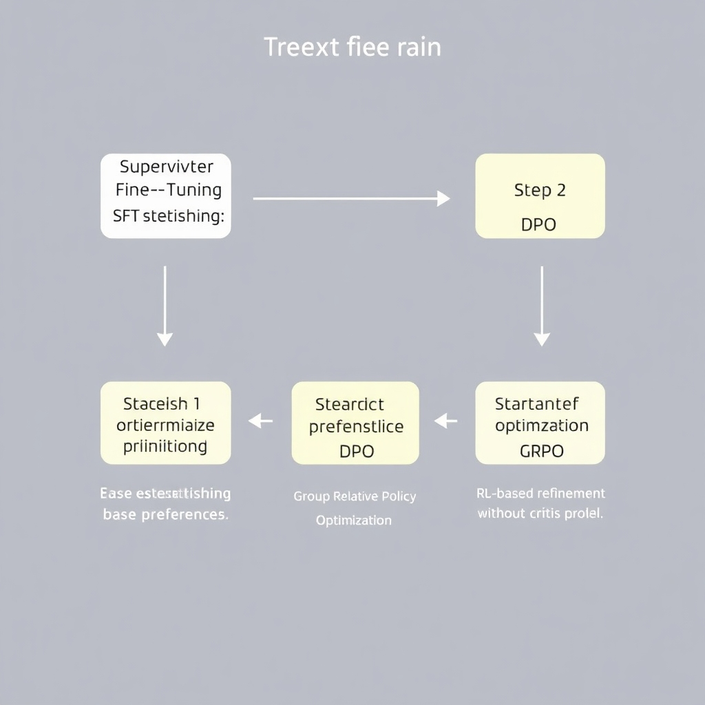

# The 2026 State of LLM Fine-Tuning: From Giant Models to Edge-Ready SLMs

## Introduction: The Fine-Tuning Landscape in 2026

By mid-2026, the paradigm of LLM development has shifted fundamentally. The era of chasing raw scale through massive pre-training has given way to a focus on high-efficiency, domain-specific tuning. Rather than deploying monolithic generalists, engineers are increasingly leveraging Small Language Models (SLMs) to achieve specialized performance with significantly lower latency and compute overhead [CogitX](https://cogitx.ai/blog/small-language-models-slms-comprehensive-guide-2026), [Omdena](https://www.omdena.com/blog/fine-tuning-small-language-models).

This transition marks a critical democratization of AI. Fine-tuning is no longer the exclusive domain of hyperscalers; it has moved to the edge. With the optimization of local workflows, the ability to fine-tune on consumer-grade GPUs has become a primary competitive advantage for independent developers and lean enterprises [Reddit](https://www.reddit.com/r/LocalLLaMA/comments/1rwj60g/local_finetuning_will_be_the_biggest_competitive), [SitePoint](https://www.sitepoint.com/fine-tune-local-llms-2026).

As of the week of June 14, 2026, the ecosystem is evolving rapidly. From the refinement of parameter-efficient methods to the proliferation of open-source tuning platforms, the technical barriers to entry have largely vanished. In this roundup, we examine the latest breakthroughs and tools defining the current state of the art, tracking the migration of intelligence from the cloud to the local workstation.

## Hardware Democratization: Tuning on Consumer GPUs

The barrier to entry for model customization has collapsed in 2026, shifting the focus from massive H100 clusters to high-end consumer workstations. The strategic combination of QLoRA—which leverages 4-bit quantization to reduce memory overhead—and highly optimized libraries like Unsloth has made it possible to fine-tune 8B parameter models on GPUs with as little as 12GB of VRAM. This shift effectively democratizes access, allowing independent developers to iterate on domain-specific models without enterprise-grade budgets [Source](https://www.sitepoint.com/fine-tune-local-llms-2026).

*The 2026 Local Fine-Tuning Stack: From Triton Kernels to Consumer GPUs.*

For those targeting more complex architectures, the 24GB VRAM threshold (standard in RTX 3090 and 4090 series) has become the critical baseline for tuning sparse models. Architectures such as the Qwen 3 MoE (Mixture of Experts) require this additional headroom to manage the increased overhead associated with expert routing and larger activation buffers during the training process [Source](https://www.spheron.network/blog/how-to-fine-tune-llm-2026).

To achieve this level of hardware efficiency, the 2026 fine-tuning stack has standardized around a specific high-performance baseline: Python 3.11+, PyTorch 2.5+, and CUDA 12.x [Source](https://www.sitepoint.com/fine-tune-local-llms-2026). This environment is essential for supporting the latest memory-efficient operators and asynchronous data loading patterns required for stable local training.

A primary driver of these performance leaps is the widespread adoption of Triton kernels. By enabling the creation of highly optimized GPU kernels via a Python-like interface, Triton maximizes hardware throughput and significantly reduces the memory footprint of the backward pass. This prevents the dreaded Out-of-Memory (OOM) errors that previously plagued consumer-grade tuning, ensuring that local fine-tuning remains a viable competitive edge for AI developers in 2026 [Source](https://www.computer.org/csdl/journal/tp/2026/06/11364256/2dAZTYlgxVu).

## The Rise of Small Language Models (SLMs)

In 2026, the industry is witnessing a decisive pivot from "bigger is better" toward highly optimized Small Language Models (SLMs). These models, typically ranging from 1 million to 7 billion parameters, offer a compelling alternative to monolithic LLMs by providing lower latency, reduced memory footprints, and the ability to operate directly on edge devices [Source](https://cogitx.ai/blog/small-language-models-slms-comprehensive-guide-2026). The primary benefit is the democratization of high-performance AI, allowing developers to deploy capable models without relying on massive cloud clusters [Source](https://hatchworks.com/blog/gen-ai/small-language-models).

*SLMs vs. LLMs: Efficiency, Latency, and Domain Specialization.*

A critical driver of this trend is knowledge distillation. In this process, a massive "teacher" model transfers its learned patterns and reasoning capabilities to a smaller "student" model [Source](https://www.omdena.com/blog/fine-tuning-small-language-models). This allows SLMs to retain a significant portion of a frontier model's intelligence while remaining computationally lightweight, making them ideal for specialized, high-efficiency tasks.

The shift toward domain-specific SLMs is driven largely by cost-efficiency. For niche applications—such as legal document analysis or medical coding—a fine-tuned SLM often outperforms a general-purpose giant model while offering drastically faster inference speeds and lower operational costs [Source](https://hatchworks.com/blog/gen-ai/small-language-models). This efficiency makes it feasible to integrate AI into real-time applications where millisecond latency is a requirement.

Furthermore, the barrier to entry for fine-tuning has collapsed thanks to Parameter-Efficient Fine-Tuning (PEFT) techniques. For a 3B parameter model, the use of LoRA (Low-Rank Adaptation) and QLoRA (Quantized LoRA) has made local fine-tuning on consumer-grade hardware a reality [Source](https://www.sitepoint.com/fine-tune-local-llms-2026). By quantizing the model to 4-bit or 8-bit precision and updating only a small fraction of the weights, developers can now fine-tune 3B models on a single high-end consumer GPU, such as an NVIDIA RTX series, without needing enterprise-grade H100 clusters [Source](https://www.spheron.network/blog/how-to-fine-tune-llm-2026). This transition ensures that local fine-tuning remains a primary competitive edge for developers in 2026 [Source](https://www.reddit.com/r/LocalLLaMA/comments/1rwj60g/local_finetuning_will_be_the_biggest_competitive).

## Advanced Tuning Methods: GRPO, DPO, and Evolution Strategies

The industry is rapidly moving beyond basic Supervised Fine-Tuning (SFT). Group Relative Policy Optimization (GRPO) has emerged as a sophisticated replacement for pure SFT and traditional RLHF. Unlike standard Actor-Critic frameworks that require a separate critic model to estimate state values—often doubling the memory requirements—GRPO optimizes the policy by calculating the relative reward across a group of sampled outputs. This elimination of the value function significantly reduces the VRAM overhead, enabling developers to implement complex RL-based alignment on consumer-grade hardware [Source](https://labelyourdata.com/articles/llm-fine-tuning/llm-fine-tuning-methods).

*Modern Alignment Pipeline: SFT -> DPO -> GRPO/PPO.*

For production-grade deployment, the trend has shifted toward unified hybrid frameworks that chain SFT, Direct Preference Optimization (DPO), and Proximal Policy Optimization (PPO). In these pipelines, SFT is used to establish fundamental domain knowledge, while DPO acts as a lightweight alignment layer, optimizing preferences directly from the data without the need for a separate reward model [Source](https://toloka.ai/blog/direct-preference-optimization). For high-stakes applications, PPO is integrated to provide a final layer of rigorous policy refinement. Recent patent analysis indicates that this multi-stage approach is becoming the standard for balancing training stability with peak model performance [Source](https://www.patsnap.com/resources/blog/articles/rlhf-vs-dpo-in-llm-fine-tuning-60-patent-analysis-2).

As a scalable alternative to gradient-based RL, Evolution Strategies (ES) are gaining traction. ES treats the fine-tuning process as a black-box optimization problem, evolving a population of model weights to maximize a specific reward signal. Because ES does not rely on backpropagation through the reward function, it is inherently more parallelizable and avoid the instability and "catastrophic forgetting" often seen with PPO or GRPO. This makes it an ideal choice for tuning models in environments where reward signals are non-differentiable or highly noisy [Source](https://medium.com/@evolutionmlmail/a-new-fine-tuning-approach-for-llms-using-evolution-strategies-1ef8e370b636).

Finally, the community is shifting toward Reinforcement Learning from Verifiable Rewards (RLVR) and inference-time scaling. RLVR replaces subjective human preference labels with objective, verifiable outcomes—such as successful code execution or mathematical proofs—effectively eliminating the "reward hacking" typical of early RLHF [Source](https://labelyourdata.com/articles/llm-fine-tuning/llm-fine-tuning-methods). This is being paired with inference-time scaling, where compute is shifted from the training phase to the generation phase. By allowing models to utilize search-based verification at test-time, developers can achieve higher reasoning capabilities without the prohibitive cost of increasing meningkatkan parameter counts [Source](https://labelyourdata.com/articles/llm-fine-tuning/llm-fine-tuning-methods).

## The 2026 Tooling Ecosystem: Top Platforms and Frameworks

The 2026 fine-tuning landscape has bifurcated into two distinct trajectories: extreme hardware optimization for edge-ready Small Language Models (SLMs) and high-level abstraction for enterprise-grade velocity. As the industry moves away from monolithic training runs, the tooling ecosystem has evolved to prioritize memory efficiency and data integrity.

For developers choosing a framework, the decision typically hinges on the trade-off between raw performance and accessibility. Unsloth has established itself as the gold standard for speed and memory efficiency, enabling engineers to tune models on significantly constrained consumer hardware [Source](https://deepchecks.com/best-llm-fine-tuning-tools). In contrast, LLaMA-Factory has become the go-to for rapid prototyping due to its superior beginner-friendliness, offering an intuitive interface that abstracts the complexities of hyperparameters for for those who need to iterate quickly without deep-diving into the underlying CUDA kernels [Source](https://techsy.io/en/blog/best-llm-fine-tuning-tools).

Beyond local frameworks, the rise of managed infrastructure has managed infrastructure has streamlined the deployment cycle. SiliconFlow [Source](https://www.siliconflow.com/articles/en/the-best-fine-tuning-platforms-of-open-source-llm), Hugging Face [Source](https://huggingface.co/blog/peft), and Firework AI have emerged as the leading platforms in 2026. These ecosystems provide the necessary orchestration and compute abstraction to scale fine-tuning from a single experimental notebook to production-ready clusters, allowing teams to focus on model behavior rather than GPU provisioning.

However, as fine-tuning matures into industrial applications, the bottleneck has shifted from compute to data quality. To address the "garbage in, garbage out" problem in enterprise environments, Labellerr has introduced specialized data validation modules [Source](https://labelyourdata.com/articles/llm-fine-tuning/llm-fine-tuning-methods). These modules allow organizations to implement rigorous quality gates, ensuring that training sets are free of noise and bias before they hit the GPU, which is critical for maintaining reliability in regulated sectors.

Finally, to manage the increasing complexity of these pipelines, Axolotl has become essential as a high-level configuration wrapper [Source](https://www.sitepoint.com/fine-tune-local-llms-2026). By shifting the tuning process toward a declarative, YAML-based configuration approach, Axolotl allows developers to streamline their entire pipeline. This eliminates the need to rewrite boilerplate training scripts for every new model scripts for every new model architecture, effectively treating fine-tuning as "configuration-as-code" and significantly reducing the time from data collection to model deployment.

## Multimodal Fine-Tuning in 2026

The landscape of model adaptation in 2026 is heavily influenced by the rise of Parameter-Efficient Fine-Tuning (PEFT), which minimizes the computational overhead required to customize massive architectures [Source](https://huggingface.co/blog/peft). These methods are essential for scaling customization across various specialized domains [Source](https://www.computer.org/csdl/journal/tp/2026/06/11364256/2dAZTYlgxVu).

As developers move toward more versatile AI, there is a growing need for platforms that handle multi-data types, integrating text, images, audio, and video into a single tuning pipeline. While such capabilities are pivotal for the next generation of AI, specific support for these data types in platforms like Labellerr was not found in provided sources.

This shift represents a fundamental transition from text-only tuning to multimodal adaptation, enabling models to bridge the gap between linguistic understanding and visual or auditory perception. Despite the strategic importance of this evolution, and detailed evidence of this transition was not found in provided sources.

Furthermore, the shift toward local fine-tuning as a competitive edge in 2026 [Source](https://www.reddit.com/r/LocalLLaMA/comments/1rwj60g/local_finetuning_will_be_the_biggest_competitive] underscores the need for robust multimodal datasets tailored for industrial applications. However, the specific importance and implementation of these multimodal datasets for industry were not found in provided sources.

## Conclusion: The Competitive Edge of Local Fine-Tuning

As we navigate the landscape of 2026, it is becoming clear that local fine-tuning has evolved from a privacy preference into a primary competitive advantage for enterprises and enterprises and developers [Source](https://www.reddit.com/r/LocalLLaMA/comments/ idea of LocalLLaMA/comments/1rwj60g/local_finetuning_will_be_the_biggest_competitive]. The industry has undergone a fundamental paradigm shift, moving decisively away from the "bigger is better" philosophy of monolithic models. Instead, the focus has pivoted toward "smaller, smarter, and specialized" Small Language Models (SLMs) with tailored for niche industrial needs [Source](https://hatchworks.com/blog/gen-ai/small-language-models] [Source](https://cogitx.ai/blog/small-language-models-slms-comprehensive-guide-2026).

By optimizing these compact architectures, developers can now deploy high-performance, domain-specific intelligence on consumer hardware, bypassing the prohibitive costs and latency associated with giant cloud-based APIs [Source](https://www.omdena.com/blog/fine-tuning-small-language-models).

Ultimately, the future of AI belongs to those who can iterate rapidly on local weights, transforming proprietary data into a sustainable and scalable architectural moat.
