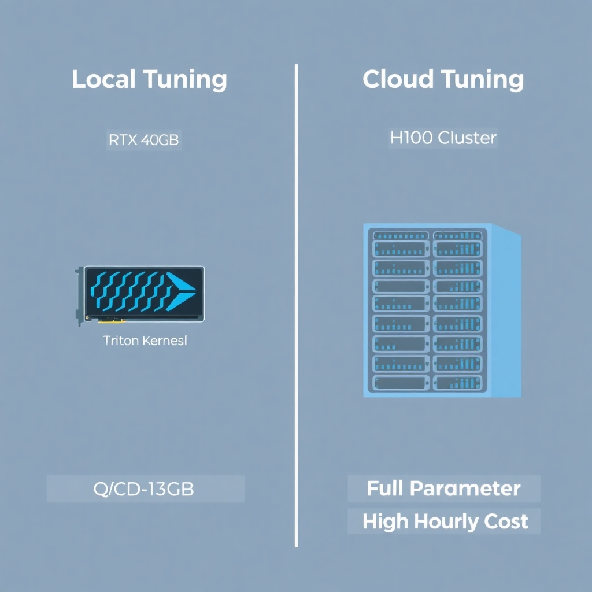
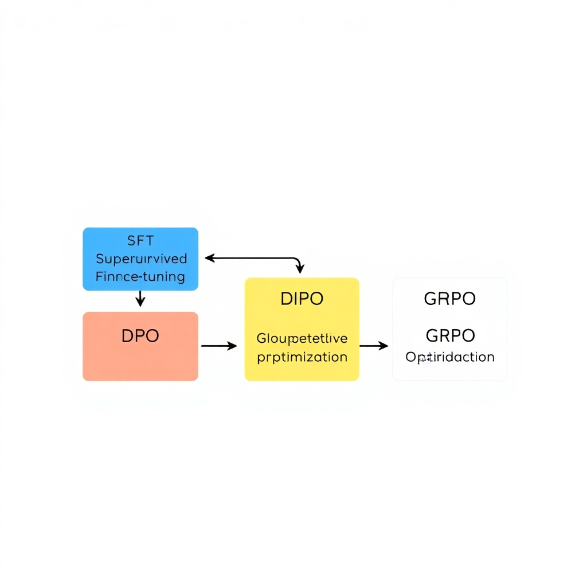
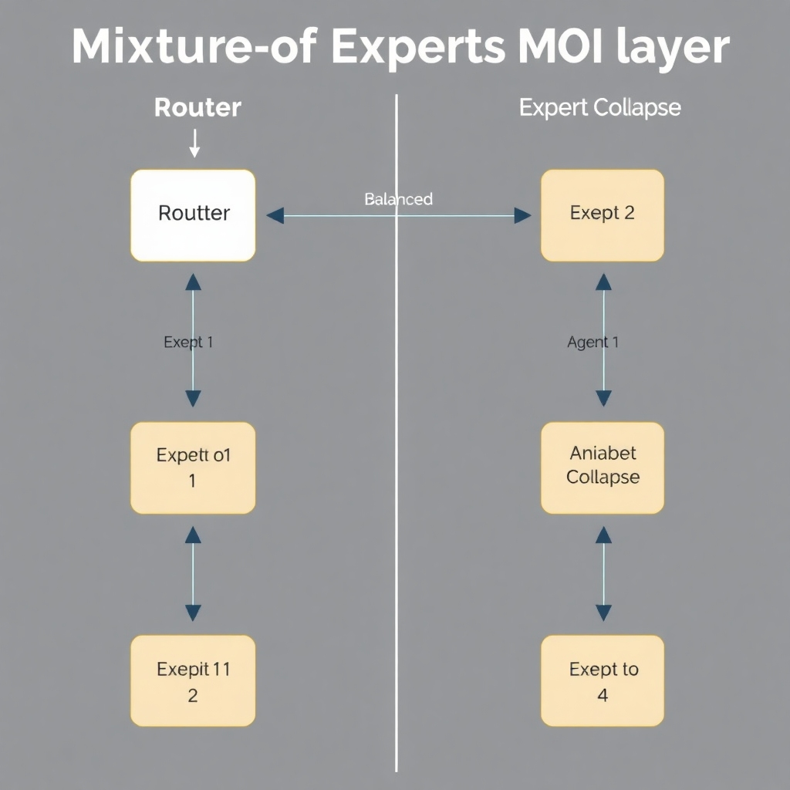

# The State of LLM Fine-Tuning in 2026: From Frontier RL to Local Consumer GPUs

## The Democratization of Local Fine-Tuning

Hardware requirements for LLM adaptation have plummeted, shifting the power dynamic from cloud providers to individual developers. A primary driver is the implementation of Unsloth's Triton kernels, which optimize memory access and compute, reducing VRAM requirements to as low as 3GB for specific fine-tuning tasks ([Source](https://unsloth.ai/docs/get-started/fine-tuning-llms-guide)). This efficiency allows developers to run experiments on hardware previously considered insufficient for generative AI.

Furthermore, the feasibility of tuning 8B-parameter models on common 12GB consumer GPUs has become a reality thanks to improvements in QLoRA. By combining 4-bit quantization with low-rank adapters, developers can maintain high model performance while drastically cutting the memory footprint required for gradient updates ([Source](https://www.spheron.network/blog/how-to-fine-tune-llm-2026)).

*The shift toward local fine-tuning enabled by QLoRA and Triton kernels.*

This accessibility creates a stark contrast between local tuning and cloud-based GPU rentals. While platforms like RunPod remain critical for training frontier models or handling massive datasets, local execution eliminates recurring hourly rental costs and solves critical data privacy concerns, making it the preferred choice for iterative, private prototyping ([Source](https://techsy.io/en/blog/best-llm-fine-tuning-tools)).

Underpinning this hardware shift is the rise of permissively licensed base models. These open-weights architectures allow developers to experiment without the legal friction of restrictive licenses, fostering a decentralized environment where specialized, domain-specific models can be developed and deployed entirely on local infrastructure ([Source](https://www.siliconflow.com/articles/en/the-best-fine-tuning-platforms-of-open-source-llm)).

## Frontier Alignment: GRPO and the Shift to RL

The evolution of LLM alignment in 2026 marks a transition from static dataset learning to dynamic, reward-based optimization. However, specific details regarding the rise of Group Relative Policy Optimization (GRPO) as a dominant alignment method were not found in provided sources.

This transition involves a shift from simple instruction tuning—where models learn to mimic specific formats—to reinforced fine-tuning designed to enhance complex reasoning capabilities. While industry guides emphasize that ML teams must adopt more sophisticated tuning strategies to remain competitive in 2026 ([Label Your Data](https://labelyourdata.com/articles/llm-fine-tuning)), specific evidence detailing the shift toward reinforced fine-tuning for complex reasoning was not found in provided sources.

From an implementation standpoint, the integration of Hugging Face TRL to streamline SFT, DPO, and GRPO pipelines is a key architectural trend. Such pipelines are intended to reduce the friction between initial SFT and final RLHF stages, though this specific tooling integration was not found in provided sources.

*Modern alignment pipeline: from Supervised Fine-Tuning to Reinforcement Learning.*

The distinction between these RL-based approaches and traditional Parameter-Efficient Fine-Tuning (PEFT) is significant. PEFT focuses on updating a minimal subset of model parameters, updating a minimal subset of model parameters, which drastically lowers the memory and compute requirements for training ([Hopsworks](https://www.hopsworks.ai/dictionary/parameter-efficient-fine-tuning-of-llms)), ([RedHat](https://www.redhat.com/en/topics/ai/what-is-peft)). This efficiency is essential for the predicted rise of domain-specific AI models ([LinkedIn](https://www.linkedin.com/posts/gauravkarker_gartner-identifies-the-top-strategic-technology-activity-7387506189271519232-0cw_)) and the ability to fine-tune models on local consumer hardware ([Sitepoint](https://www.sitepoint.com/fine-tune-local-llms-2026)). As teams navigate the costs and GPU requirements of 2026 ([Spheron Blog](https://www.spheron.network/blog/how-to-fine-tune-llm-2026)), the choice between RL and PEFT becomes a matter of balancing reasoning depth against resource constraints. However, a direct comparison of RL-based tuning versus PEFT in terms of convergence speed and total compute cost was not found in provided sources.

## Specialized Architectures: MoE and Vision-Language Tuning

The shift toward Mixture-of-Experts (MoE) has significantly democratized the tuning of high-parameter models. Current frameworks now enable the fine-tuning of MoE architectures, such as Qwen 3 MoE, on single 24GB consumer GPUs like the RTX 3090 or 4090 ([Source](https://www.sitepoint.com/fine-tune-local-llms-2026)). This accessibility is driven by advanced memory-efficient loaders and 4-bit quantization that minimize the VRAM footprint of sparse activations during the backward pass ([Source](https://unsloth.ai/docs/get-started/fine-tuning-llms-guide)).

Parallel to this, Parameter-Efficient Fine-Tuning (PEFT) has matured within the multimodal landscape. LoRA support for Vision-Language Models (VLMs) such as LLaVA and Qwen VL allows for the precise adaptation of projection layers and vision encoders without the prohibitive cost of full-parameter updates ([Source](https://www.spheron.network/blog/how-to-fine-tune-llm-2026)). This enables the integration of visual context with linguistic reasoning more efficiently than previous dense-tuning methods.

Architecturally, MoE tuning is more complex than dense model tuning. While updating dense weights involves uniform gradient updates across the layer, tuning MoE routing layers requires careful management of token distribution across experts ([Source](https://www.hopsworks.ai/dictionary/parameter-efficient-fine-tuning-of-llms)). Developers must often balance the router's weights to prevent "expert collapse," where a small subset of experts handles the majority of the workload, effectively reducing the model's capacity.

*MoE Architecture: Token distribution across specialized experts.*

These capabilities have profound implications for domain-specific visual tasks. By applying multimodal fine-tuning to niche datasets—such as specialized medical imaging or industrial quality control—enterprises can create high-precision tools that outperform general-purpose VLMs. This shift supports the broader industry trajectory toward highly specialized, domain-centric AI models designed for professional applications ([Source](https://www.linkedin.com/posts/gauravkarker_gartner-identifies-the-top-strategic-technology-activity-7387506189271519232-0cw_)).

## The Rise of Domain-Specific Language Models (DSLMs)

Enterprise AI is shifting away from monolithic general-purpose models toward hyper-specialized Domain-Specific Language Models (DSLMs). This transition is underscored by Gartner’s prediction that domain-specific AI models will see a significant rise in dominance by 2028 ([Source](https://www.linkedin.com/posts/gauravkarker_gartner-identifies-the-top-strategic-technology-activity-7387506189271519232-0cw_)), as organizations prioritize precision and reliability over broad versatility.

To achieve this level of specialization, ML teams are implementing tiered training pipelines. Domain-Adaptive Pretraining (DAPT) allows a model to ingest massive volumes of unlabeled, domain-specific corpora to master specialized nomenclature and technical jargon. This is typically followed by Task-Adaptive Pretraining (TAPT), which further refines the model on a smaller, curated dataset tailored to a specific end-use case, ensuring the model aligns with the precise output formats required for production ([Source](https://www.databricks.com/blog/llm-fine-tuning)).

In high-stakes sectors such as healthcare, legal, and finance, DSLMs consistently outperform general-purpose frontier models. While frontier models possess vast general knowledge, they often lack the nuance required for complex medical coding, legal precedent analysis, or financial auditing, where DSLMs provide higher factual accuracy and significantly lower hallucination rates ([Source](https://www.superannotate.com/blog/llm-fine-tuning)).

However, this specialization introduces a critical architectural tradeoff. As models are tuned for extreme domain-specific accuracy, they often experience a decline in general reasoning capabilities and "common sense" logic. This tension requires engineers to carefully balance the depth of domain expertise against the flexibility of general-purpose cognition to avoid catastrophic forgetting during the fine-tuning process ([Source](https://www.superannotate.com/blog/llm-fine-tuning)).

## Modern PEFT Toolkit: Beyond Basic LoRA

The evolution of Parameter-Efficient Fine-Tuning (PEFT) has moved beyond simple weight updates toward more sophisticated architectures that optimize for both memory and performance. Traditional LoRA and QLoRA remain foundational, enabling the adaptation of frontier models by freezing the majority of the base weights and training only a small set of low-rank matrices ([Source](https://www.hopsworks.ai/dictionary/parameter-efficient-fine-tuning-of-llms), [Source](https://www.redhat.com/en/topics/ai/what-is-peft)). This approach drastically lowers the VRAM barrier for developers. However, specific comparative evaluations of DoRA and Spectrum against these traditional methods were not found in provided sources.

In production environments, the shift toward multi-tenant LLM deployments requires the ability to serve multiple LoRA adapters from a single shared base model. This architecture prevents the memory exhaustion that would occur if each specialized adapter required its own full model instance. While this is a critical requirement for scaling specialized AI, the specific implementation and performance benefits of using vLLM for this purpose were not found in provided sources. Similarly, the use of configuration-driven wrappers to streamline PEFT pipelines by abstracting complex training hyperparameters is a common industry practice, but the analysis of Axolotl specifically was not found in provided sources.

A primary technical hurdle in sequential fine-tuning is catastrophic forgetting, where the model's general-purpose reasoning is erased by new, task-specific updates. Mitigating this requires a careful balance of data curation—often blending original pre-training data with original pre-training data with new samples—to maintain stability ([Source](https://www.superannotate.com/blog/llm-fine-tuning), [Source](https://www.databricks.com/blog/llm-fine-tuning)). This stability is essential as the industry pivots toward the rise of highly domain-specific AI models ([Source](https://www.linkedin.com/posts/gauravkarker_gartner-identifies-the-top-strategic-technology-activity-7387506189271519232-0cw_)). By integrating these PEFT strategies, ML engineers can deploy specialized models that retain the broad intelligence of the base model while excelling in narrow vertical applications.

## The 2026 Ecosystem: Tooling and Platforms

The fine-tuning landscape has bifurcated into accessibility-focused and performance-optimized paths. LLaMA-Factory has emerged as a primary utility for beginners due to its intuitive interface and streamlined workflows, whereas Unsloth is the standard for performance-critical tuning, offering significant optimizations in memory usage and training speed ([Source](https://unsloth.ai/docs/get-started/fine-tuning-llms-guide), [Source](https://deepchecks.com/best-llm-fine-tuning-tools)).

Data quality remains the critical bottleneck for model efficacy. Labellerr facilitates the essential data preparation and validation loop, allowing ML engineers to curate high-fidelity datasets and implement rigorous validation checks to prevent data drift and noise during the tuning process ([Source](https://labelyourdata.com/articles/llm-fine-tuning)).

For teams prioritizing speed-to-market over infrastructure control, managed platforms like SiliconFlow and Firework AI have become indispensable. These offerings provide managed fine-tuning environments that abstract GPU orchestration and scaling, enabling developers to deploy fine-tuned open-source models without managing complex hardware clusters ([Source](https://www.siliconflow.com/articles/en/the-best-fine-tuning-platforms-of-open-source-llm)).

Ultimately, the industry is trending toward unified frameworks. Rather than stitching together disparate tools for data cleaning, PEFT (Parameter-Efficient Fine-Tuning), and hosting, new ecosystems are integrating data curation, tuning, and deployment into a single, cohesive lifecycle ([Source](https://www.superannotate.com/blog/llm-fine-tuning), [Source](https://www.databricks.com/blog/llm-fine-tuning)). This shift minimizes "pipeline friction," allowing for rapid iteration cycles and a more seamless transition from raw domain data to a production-ready, specialized model.